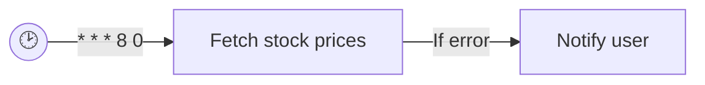
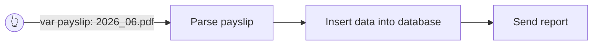
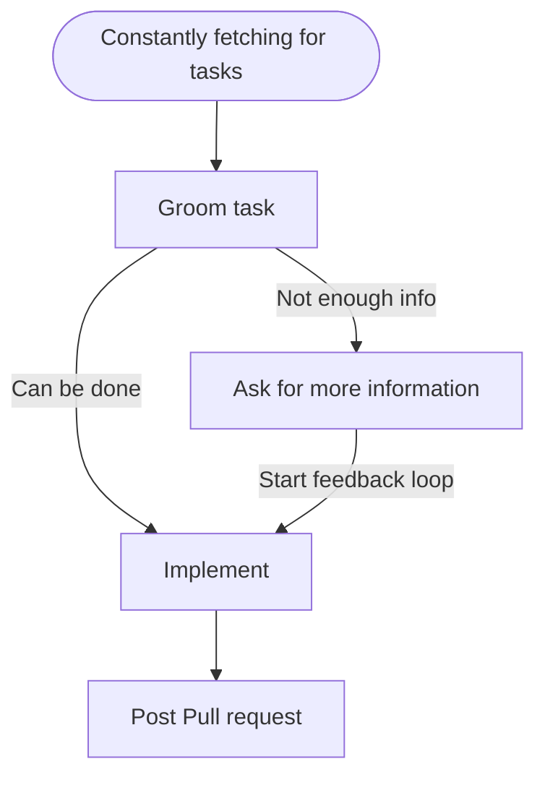

# Finding a workflow app

In this repo, I will compare different apps to run AI and non-AI workflows.

The use cases I want to cover are:

- Cronjobs:



- Worlflows (on demand or scheduled) with input variables:



- Agentic workflows:



Some basic features I want to cover are:

- Store logs
- Store exit codes
- Run later if the laptop/app was off
- Send notifications to some messaging app

---

## Solutions Comparison

| Solution                                                        | Stars | Parameters | Cronjobs | Workflows | Agentic workflows | Offline Catch-up | Logs in UI | Exit Codes | Notifications |
| --------------------------------------------------------------- | ----- | ---------- | -------- | --------- | ----------------- | ---------------- | ---------- | ---------- | ------------- |
| **systemd/launchd** (customized)                                |       | ✅         | ✅       | ⚒️        | ❌                | ❌               | ⚒️         | ⚒️         | ⚒️            |
| **[n8n](https://github.com/n8n-io/n8n)**                        | 198K  | ✅         | ✅       | ✅        | ✅                | ❌               | ✅         | ✅         | ✅            |
| **[Temporal](https://github.com/temporalio/temporal)**          | 22K   | ✅         | ✅       | ✅        | ⚒️                | ✅               | ✅         | ✅         | ⚒️            |
| **[dagu](https://github.com/dagucloud/dagu)**                   | 4K    | ✅         | ✅       | ✅        | ✅                | ✅               | ✅         | ✅         | ⚒️            |

\*Stars at 2026-07-24.

### Next... agent frameworks that are too much for this PoC

| Solution                                                        | Stars |
| ---------------------------------------------------------------- | ----- |
| **[CrewAI](https://github.com/crewaiinc/crewai)**                | 56K   |
| **[Kestra](https://github.com/kestra-io/kestra)**                | 27K   |
| **[Mastra](https://github.com/mastra-ai/mastra)**                | 27K   |
| **[Prefect](https://github.com/PrefectHQ/prefect)**              | 23K   |
| **[iii](https://github.com/iii-hq/iii)**                         | 19K   |
| **[Trigger.dev](https://github.com/triggerdotdev/trigger.dev)**  | 16K   |

### systemd/launchd

See [`launchd/`](./launchd/) for a macOS LaunchAgent experiment (Python runner: logs, exit codes, Telegram).

I've added a simple UI that shows the exit codes and logs. It's an implementation done by AI in less than 10 minutes. If you spend some more time on it, you can end up with a quite decent tool.

Simple but efficient and gets the job done.

### n8n

See [`n8n/`](./n8n/) for a Podman setup with two starter workflows (cron stock fetch + on-demand webhook), matching the launchd examples. Agentic workflow left for manual setup in the UI.

I was really impressed by the execution time:

```sh
❯ time curl -s -X POST http://localhost:5678/webhook/fetch-stock \
  -H 'Content-Type: application/json' \
  -d '{"ticker":"IBM"}'
{"ok":true,"exit_code":0,"job_name":"fetch-IBM","ticker":"IBM","symbol":"IBM","price":234.71,"output":"IBM=234.71"}

curl -s -X POST http://localhost:5678/webhook/fetch-stock -H  -d   0.01s user 0.01s system 2% cpu 0.450 total
```

Cursor is also able to interacti with the database and define, import, export or troubleshoot workflows itself.

I set up an AI agent node with an OpenRouter free API key using Deepseek.

### Temporal

See [`temporal/`](./temporal/) for a Podman setup with the Temporal dev server (single binary + Web UI) plus a Python worker, matching the launchd/n8n stock-fetch examples: a cron `Schedule` and an on-demand script, both running the same `FetchStockWorkflow`.

Unlike n8n, offline catch-up actually works here — Schedules have a real catch-up window, so a missed cron tick fires once the server is back up instead of being silently dropped. Retries are also built in: a failed quote fetch is retried automatically before falling back to a Telegram alert.

There's no visual editor and no webhook trigger — everything is Python code, and the "on-demand" trigger shells into the server container's bundled CLI (`temporal workflow execute`) rather than curl-ing an HTTP endpoint:

```sh
❯ time ./scripts/run-on-demand.sh IBM
{
  "workflowId": "fetch-ibm-1789722132",
  ...
  "result": {"ok": true, "exit_code": 0, "symbol": "IBM", "price": 237.75, "output": "IBM=237.75", ...}
}
./scripts/run-on-demand.sh IBM  0.02s user 0.02s system 7% cpu 0.518 total
```

It's as fast as n8n.

Agentic workflows aren't a first-class concept — the PoC adds one as plain Python: `NotionTaskSummaryWorkflow` (Notion page → OpenRouter Spanish summary), started via `scripts/run-notion-summary.sh`.

### dagu

See [`dagu/`](./dagu/) for a single-container Podman setup (no DB, no separate worker process) with a cron DAG, an on-demand DAG, and an Agent DAG (`type: agent`) that uses OpenRouter to triage machine health and write a summary.

Like Temporal, offline catch-up is real — set a `catchup_window` on the cron DAG and a missed tick actually runs when the server comes back, instead of being silently dropped like n8n/launchd. It even fired a catch-up run on the very first start, before the schedule had ticked once.

```sh
❯ time ./scripts/run-on-demand.sh IBM
Succeeded - 2026-09-18T11:24:17+02:00

dag: fetch-stock-on-demand (0s)
├─fetch (0s) [succeeded]
│ └─stdout: {"ok":true,"exit_code":0,"job_name":"fetch-ibm","ticker":"IBM","symbol":"IBM","price":237.75,"output":"IBM=237.75"}
```

Of the three self-hosted options this is the lightest: one container, one binary, `dags/*.yaml` picked up live with no import step. No visual editor and no webhook trigger (same as Temporal — the on-demand script shells into the container's CLI), though dagu does expose a REST API (`POST /api/v1/dags/{file}/start`) if you want a real HTTP trigger.

## Resources

| Tool     | Process Memory        | Container Memory |
|----------|-----------------------|------------------|
| Launchd  | No additional process | N/A              |
| Temporal | ~250MB                | ~300MB           |
| n8n      | ~500MB                | ~700MB           |
| Dagu     | ~250MB                | ~550MB           |

## Summary

Both Dagu and Temporal provide a good way of defining workflows as Python/YAML files and give a nice visualization of the past runs and timeline. However, if you don't define much cronjobs, they may be overkill. Having a simple launchd with some custom scripts to store, visualize and notify results is
- easier to understand
- easier to maintain
- consumes less resources
- more customizable
- grows with your needs

Then there is n8n on the other side that enables a lot of connectors to other apps and LLMs out of the box, but that may be an overkill for a single developer. However, for non-technical teams that would be game changer.
