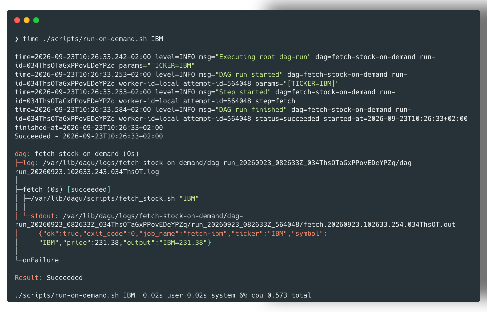
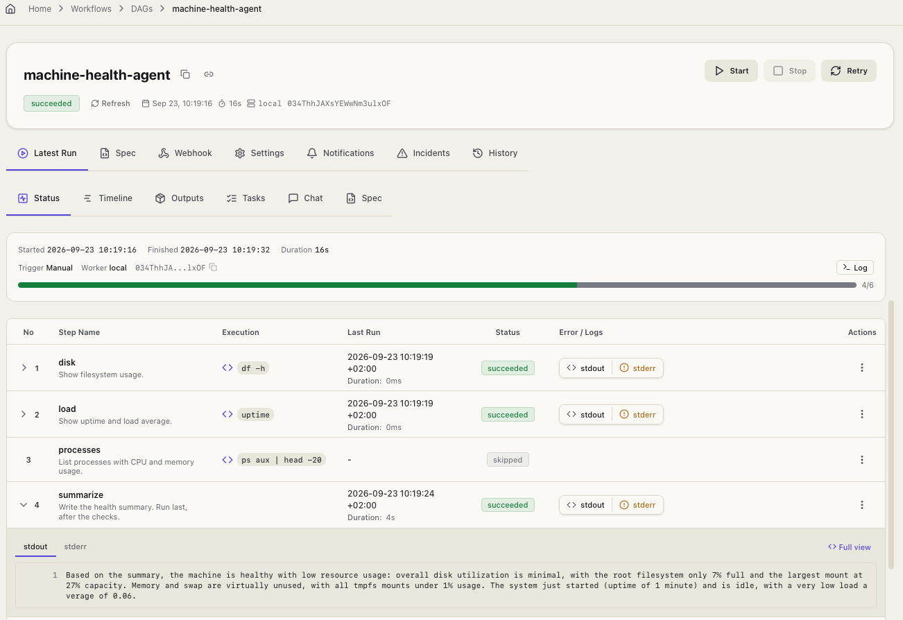

# dagu experiment

Self-hosted [dagu](https://dagu.sh/) via **Podman** (single binary, no DB), mirroring the launchd/n8n/temporal stock-fetch examples:

| Use case | launchd equivalent | Temporal equivalent | dagu |
| -------- | ------------------- | -------------------- | ---- |
| Cron | `fetch-aapl` plist | `fetch-stock-cron-aapl` Schedule | `dags/fetch-stock-cron-aapl.yaml` (`schedule:`, every 5 min) |
| On demand + input | `runner.py --name fetch-aapl -- … AAPL` | `scripts/run-on-demand.sh AAPL` | `scripts/run-on-demand.sh AAPL` (`dagu start ... -- TICKER=AAPL`) |
| Agentic | — | — | `dags/machine-health-agent.yaml` (`type: agent` + OpenRouter) |

Both stock DAGs run the same `scripts/fetch_stock.sh` (curl + jq — both ship in the base image, no Python needed). Telegram failure alerts use the same env vars as launchd/n8n/temporal (`TELEGRAM_BOT_TOKEN`, `TELEGRAM_CHAT_ID`), wired via each DAG's `handler_on.failure`.

The agent DAG lets an LLM pick which checks to run (`df`, `uptime`, optionally `ps`) and then write a short health summary via `action: chat.completion`. No visual editor — still YAML.





## Layout

```
dagu/
  compose.yaml                       # single container: dagu start-all (server + scheduler)
  dags/fetch-stock-cron-aapl.yaml     # schedule + catchup_window + handler_on.failure
  dags/fetch-stock-on-demand.yaml     # same step, no schedule, triggered with params
  dags/machine-health-agent.yaml      # type: agent — LLM triages disk/load/ps + summary
  scripts/fetch_stock.sh              # shared fetch logic (curl + jq)
  scripts/up.sh                        # podman compose up
  scripts/run-on-demand.sh             # dagu start ... -- TICKER=<ticker>
  .env.example
```

## Setup

1. Copy env and set secrets (Telegram optional; OpenRouter required for the agent DAG):

   ```bash
   cd dagu
   cp .env.example .env
   # OPENROUTER_API_KEY=...
   ```

2. Start dagu:

   ```bash
   chmod +x scripts/*.sh
   ./scripts/up.sh
   ```

   Open http://localhost:8080 for the Web UI (no login — `DAGU_AUTH_MODE=none` for this PoC).

## Try the on-demand DAG

```bash
time ./scripts/run-on-demand.sh IBM
```

`dagu start` runs synchronously and prints the step tree with output inline:

```
Succeeded - 2026-09-18T11:24:17+02:00

dag: fetch-stock-on-demand (0s)
├─fetch (0s) [succeeded]
│ └─stdout: {"ok":true,"exit_code":0,"job_name":"fetch-ibm","ticker":"IBM","symbol":"IBM","price":237.75,"output":"IBM=237.75"}
./scripts/run-on-demand.sh IBM  0.01s user 0.01s system 6% cpu 0.408 total
```

Same JSON shape as the n8n webhook / Temporal on-demand result.

## Try the agent DAG

Set `OPENROUTER_API_KEY` in `.env`, recreate the container (`./scripts/up.sh`), then start from the Web UI or:

```bash
podman exec finding-a-workflow-dagu dagu start machine-health-agent
```

The model chooses which catalog steps to run until task `triage` is done (disk + load always; processes only if unhealthy; then a three-sentence `chat.completion` summary).

## Add more tickers (cron)

Copy `dags/fetch-stock-cron-aapl.yaml`, rename, change the `TICKER` default and the `schedule`. It's picked up automatically — no import/restart step, dagu watches the `dags/` directory.

## Stop / remove

```bash
cd dagu
podman compose down
# state persists in Podman volume finding-a-workflow-dagu-data
```

## Notes vs n8n / Temporal

- **Logs & exit codes**: per-step stdout/stderr logs on disk under the data volume, browsable in the Web UI (Executions tab) same as n8n; unlike n8n, log *files* are also directly on disk if you want to `grep` them without the UI.
- **Offline catch-up**: real ✅, same as Temporal. `catchup_window: "1h"` on the cron DAG — on first start with no prior state, dagu treated the last hour as missed and ran a `catchup-*` run immediately (visible in the Web UI history).
- **No built-in webhook trigger**: like Temporal, there's no HTTP node/webhook concept — `run-on-demand.sh` shells into the container and uses the bundled `dagu` CLI. (dagu does have a REST API — `POST /api/v1/dags/{file}/start` — if you want an actual HTTP trigger instead of `podman exec`.)
- **Simplicity**: single container, single binary, no separate worker process (unlike Temporal's server+worker split). Closest to launchd in spirit, but with a real UI, catch-up, and retries.
- It also supports **LLMs**, as documented in https://docs.dagu.sh/step-types/llm/ and some notifications, f.e. to email (https://docs.dagu.sh/step-types/mail).
