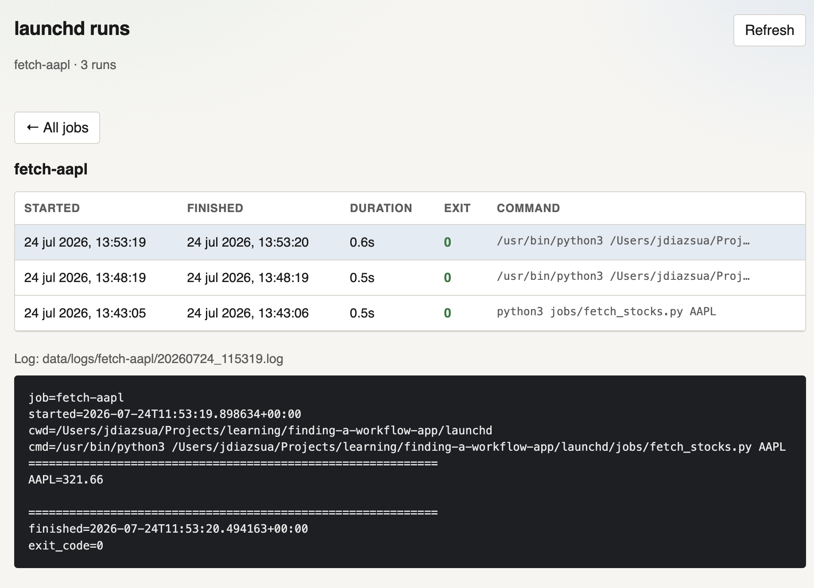

# launchd experiment

Minimal macOS scheduling via **launchd**, with a small Python wrapper that handles:

- run logs
- exit-code history
- Telegram notifications (bot token)

Agents and rich parameterized UIs are out of scope here. Keep job logic in plain scripts; put scheduling + observability in `runner.py` + a plist.

## Layout

```
launchd/
  runner.py              # wraps any command
  stamp_exec.sh          # timestamps launchd stdout/stderr lines
  jobs/fetch_stocks.py   # quote fetcher; ticker is argv
  plists/fetch-*.plist   # AAPL / TSLA / GOOG / IBM (every 5 min)
  plists/*.plist.example # launchd agent templates
  viewer/index.html      # local dashboard for runs + logs
  .env.example           # Telegram credentials
  data/                  # created at runtime (gitignored)
    logs/<job>/<ts>.log
    runs.jsonl           # one JSON object per run
```

## Setup

1. Copy env and fill in Telegram values:

   ```bash
   cp .env.example .env
   ```

   Create a bot with [@BotFather](https://t.me/BotFather), then get your chat id (e.g. message the bot and open `https://api.telegram.org/bot<TOKEN>/getUpdates`).

2. Smoke-test without launchd (ticker is a required argument):

   ```bash
   cd launchd
   python3 runner.py --name fetch-aapl -- python3 jobs/fetch_stocks.py AAPL
   ```

   Force a notification:

   ```bash
   python3 runner.py --name fetch-aapl --notify always -- python3 jobs/fetch_stocks.py AAPL
   ```

3. Install the LaunchAgents (four tickers: AAPL, TSLA, GOOG, IBM). Paths in
   `plists/com.findingaworkflow.fetch-*.plist` already point at this machine;
   copy them into LaunchAgents (or start from `fetch-ticker.plist.example`):

   ```bash
   cp plists/com.findingaworkflow.fetch-stocks.plist.example \
     ~/Library/LaunchAgents/com.findingaworkflow.fetch-stocks.plist
   # edit absolute paths in that plist
   launchctl bootout gui/$(id -u)/com.findingaworkflow.fetch-stocks 2>/dev/null || true

   for t in aapl tsla goog ibm; do
     cp "plists/com.findingaworkflow.fetch-${t}.plist" \
       ~/Library/LaunchAgents/com.findingaworkflow.fetch-${t}.plist
     launchctl bootout gui/$(id -u)/com.findingaworkflow.fetch-${t} 2>/dev/null || true
     launchctl bootstrap gui/$(id -u) ~/Library/LaunchAgents/com.findingaworkflow.fetch-${t}.plist
   done
   ```

4. Trigger once manually:

   ```bash
   for t in aapl tsla goog ibm; do
     launchctl kickstart -k gui/$(id -u)/com.findingaworkflow.fetch-${t}
   done
   ```

5. Unload when done:

   ```bash
   for t in aapl tsla goog ibm; do
     launchctl bootout gui/$(id -u)/com.findingaworkflow.fetch-${t}
   done
   ```

You can list the installed LaunchAgents with:

```bash
launchctl print gui/$(id -u) | grep findingaworkflow
```

Or get the detailed information with:

```bash
launchctl print gui/$(id -u)/com.findingaworkflow.fetch-${ticker}
```

You can remove the LaunchAgents with:

```bash
for t in aapl tsla goog ibm; do
  launchctl bootout gui/$(id -u)/com.findingaworkflow.fetch-${t} 2>/dev/null || true
  rm ~/Library/LaunchAgents/com.findingaworkflow.fetch-${t}.plist
done
```

## Troubleshooting

### `Operation not permitted` opening `runner.py`

launchd jobs are **not** your Terminal session. macOS TCC blocks agents from reading `~/Documents` (and Desktop/Downloads) unless the executable has **Full Disk Access**.

Typical err log:

```text
python3: can't open file '.../Documents/.../runner.py': [Errno 1] Operation not permitted
```

Fix (pick one):

1. **Grant Full Disk Access** (keeps the repo where it is):
   - System Settings → Privacy & Security → Full Disk Access
   - Add the real interpreter from the err log, e.g.  
     `/Library/Developer/CommandLineTools/usr/bin/python3`  
     (and/or `/usr/bin/python3`)
   - Toggle it on, then reload:

     ```bash
     launchctl bootout gui/$(id -u)/com.findingaworkflow.fetch-stocks 2>/dev/null || true
     launchctl bootstrap gui/$(id -u) ~/Library/LaunchAgents/com.findingaworkflow.fetch-aapl.plist
     launchctl kickstart -k gui/$(id -u)/com.findingaworkflow.fetch-stocks
     ```

2. **Move the project** out of `Documents`/`Desktop`/`Downloads` (e.g. `~/Projects/...`) and update absolute paths in the plist.

Terminal-only success does **not** prove the LaunchAgent can read the same path.

## Runner CLI

```text
python3 runner.py --name JOB [--notify failure|always|never] [--cwd DIR] -- COMMAND...
```

| Flag       | Meaning                                                        |
| ---------- | -------------------------------------------------------------- |
| `--name`   | Folder under `data/logs/` and label in `runs.jsonl` / Telegram |
| `--notify` | `failure` (default), `always`, or `never`                      |
| `--cwd`    | Working directory for the child process                        |

Exit code of the runner matches the child process.

## Viewer

Simple HTML dashboard over `data/runs.jsonl` (job health + run history + log bodies). Must be served over HTTP so the browser can fetch the JSONL and logs:

```bash
cd launchd
python3 -m http.server 8765
# open http://localhost:8765/viewer/
```



## Adding another job

1. Put a script under `jobs/` that returns a non-zero exit code on failure.
2. Copy a plist example, change `Label`, `--name`, command, and schedule.
3. Install with `launchctl bootstrap` as above.

On-demand (no schedule): omit `StartCalendarInterval` and run via `runner.py` or `launchctl kickstart`.

### Adding another ticker

1. Copy `plists/com.findingaworkflow.fetch-ticker.plist.example` (or an existing `fetch-*.plist`).
2. Set `Label`, `--name`, the ticker argv, and log paths (e.g. `fetch-msft` / `MSFT`).
3. Install with `launchctl bootstrap` as above.

On-demand (no schedule): omit `StartCalendarInterval` and run via `runner.py` or `launchctl kickstart`.

## What's missing

Offline catch-up and agents are out of scope here. It needs manual
implementation or combining this tool with another one.
