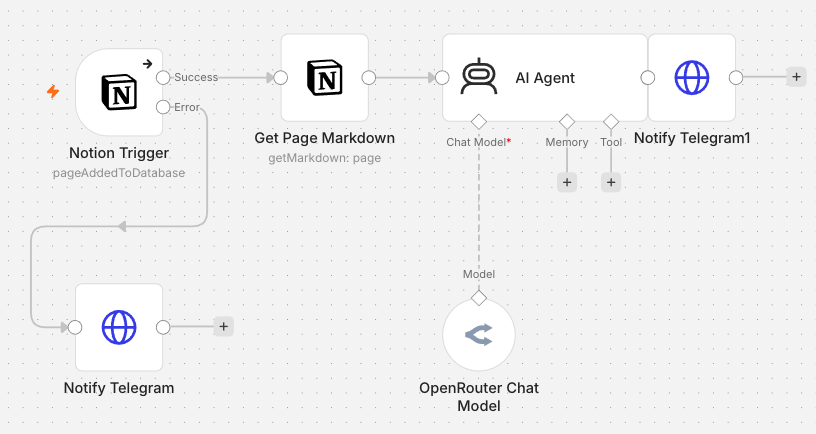

# n8n experiment

Self-hosted [n8n](https://n8n.io/) via **Podman**, mirroring the launchd stock-fetch examples:

| Workflow | launchd equivalent | Trigger |
| -------- | ------------------ | ------- |
| `fetch-stock-cron-aapl` | `fetch-aapl` plist | every 5 minutes |
| `fetch-stock-on-demand` | `runner.py --name fetch-aapl -- … AAPL` | webhook `POST /webhook/fetch-stock` |
| `fetch-stock-form` | same, via UI | form (Execute workflow → enter ticker) |
| `notion-task-summary` | same, via UI | form (Execute workflow → takes the latest task created in Notion) |

n8n does not allow **Form Trigger** and **Respond to Webhook** in the same workflow, so the UI form is a separate workflow from the webhook API.

Telegram failure alerts use the same env vars as launchd (`TELEGRAM_BOT_TOKEN`, `TELEGRAM_CHAT_ID`).



## Layout

```
n8n/
  compose.yaml
  scripts/up.sh
  scripts/import-workflows.sh   # repo → n8n (push)
  scripts/export-workflows.sh   # n8n → repo (pull UI edits)
  scripts/check-workflows.sh    # diff without writing
  workflows/*.json              # version-controlled workflow definitions
  .env.example
  data/                 # legacy host copy (optional); runtime DB is in Podman volume
```

## Setup

1. Copy env and set secrets:

   ```bash
   cd n8n
   cp .env.example .env
   # edit N8N_ENCRYPTION_KEY (long random string)
   # optional: TELEGRAM_BOT_TOKEN + TELEGRAM_CHAT_ID (same as launchd/.env)
   ```

2. Start the container:

   ```bash
   chmod +x scripts/*.sh
   ./scripts/up.sh
   ```

   Open http://localhost:5678 and create the owner account on first visit.

3. Import workflows (n8n CLI only — stable IDs in JSON overwrite on re-import):

   ```bash
   ./scripts/import-workflows.sh
   ```

   After editing in the UI, pull changes back into git:

   ```bash
   ./scripts/export-workflows.sh    # overwrite n8n/workflows/*.json from n8n
   ./scripts/check-workflows.sh     # exit 1 if UI and repo differ (no writes)
   ```

   `check-workflows.sh` compares nodes, connections, settings, name, and active state (ignores `versionId` / tags metadata).

   If the database is broken (e.g. `SQLITE_CORRUPT` or `SQLITE_IOERR`), try repair first:

   ```bash
   ./scripts/repair-db.sh
   ```

   If that fails, reset and re-import:

   ```bash
   ./scripts/import-workflows.sh --reset
   ```

   `--reset` deletes the DB in the Podman volume `finding-a-workflow-n8n-data` (owner account + execution history). Recreate the owner account at http://localhost:5678, then use the workflows as usual.

   On first visit, create the owner account at http://localhost:5678. Workflows are published by the import script.

## Try the on-demand workflow

### Form run (UI)

1. Open **`fetch-stock-form`** in the editor (not `fetch-stock-on-demand`).
2. Click **Execute workflow** — n8n opens a form in the browser.
3. Enter a ticker (e.g. `IBM`) and submit.
4. You get a completion page with the quote (or an error message).

### Webhook (curl)

```bash
# JSON body
curl -s -X POST http://localhost:5678/webhook/fetch-stock \
  -H 'Content-Type: application/json' \
  -d '{"ticker":"AAPL"}'

# query param (still POST — webhook is configured for POST only)
curl -s -X POST 'http://localhost:5678/webhook/fetch-stock?ticker=GOOG'
```

Success response looks like `{"ok":true,"exit_code":0,"symbol":"AAPL","price":…,"output":"AAPL=…"}`.

## Add more tickers (cron)

Duplicate `fetch-stock-cron-aapl` in the UI, change `job_name` / `ticker` in the **Set ticker** node, and activate. Or copy the JSON file, rename, edit, re-import.

## Stop / remove

```bash
cd n8n
podman compose down
# DB persists in Podman volume finding-a-workflow-n8n-data
```

## SQLite on Podman (macOS)

n8n stores its DB in a **named Podman volume**, not a host bind mount. SQLite WAL mode breaks on macOS↔VM bind mounts (`SQLITE_IOERR`). Do not run `sqlite3` on `data/database.sqlite` while n8n is running.

If you see I/O errors: `./scripts/repair-db.sh`

## Notes vs launchd

- **Logs & exit codes**: n8n keeps execution history in the UI (Executions tab); no local `runs.jsonl`.
- **Offline catch-up**: scheduled runs only fire while n8n is up (same limitation as launchd when the laptop is off).
- **Telegram**: uses HTTP Request + `$env` vars (requires `TELEGRAM_*` in `.env` and container recreate after changes). The editor may still show “access denied” in expression previews; runtime should work once env access is enabled in `compose.yaml`.
